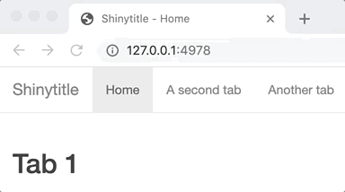

<!-- badges: start -->
<!-- badges: end -->

# shinytitle

{shinytitle} updates the page title based on the active tab in `shiny::navbarPage`.

## Example

Place `shinytitle::use_shinytitle()` in the footer.

```r
library(shiny)

ui <- navbarPage(
  "Shinytitle", # base title
  tabPanel(
    "Home",
    h2("Tab 1")
  ),
  tabPanel(
    "A second tab",
    h2("Tab 2")
  ),
  tabPanel(
    "Another tab",
    h2("Tab 3")
  ),
  footer = list(
    # update page title
    shinytitle::use_shinytitle()
  )
)

server <- function(input, output){

}

shinyApp(ui, server)
```



## Get it

You can install shinytitle from Github with:

```r
# install.packages("remotes")
remotes::install_github("JohnCoene/shinytitle")
```
